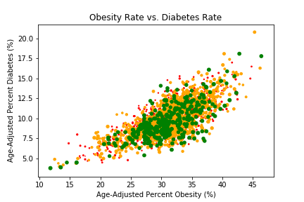

# Food Environment Project
Evaluation of the Impact of Food Environment to Health Outcome.  This project is taking the fast food restaurant data from Yelp to evaluate the effect of accessibility of fast food may explain the health outcome of the neighborhood.  

## Objective:
The main objective of this project is to examining the relationship between the food environment and health outcome (obesity & diabetes) at country level.
This project is inspired by the paper >Examining the relationship between the food environment and adult diabetes prevalence by county economic and racial composition:  an ecological study  
(Haynes-Maslow & Leone, Aug 09, 2017), (https://www.ncbi.nlm.nih.gov/pmc/articles/Pmc5551001/).

## Data Source:
Data used in this project is collected from several sources at the country level.
- Center for Disease Control and Prevention (CDC)
- U.S. Census Bureau (U.S. Census Data)
- SimpleMaps Geographic Data Products (www.simplemap.com)
- Yelp API (https://www.yelp.com/developers)

## Methodology:
Several hypothesis testings were used in this project to investigate the correlation between food environment and health outcomes.
### Level 1: Independence t-Test
Objective: Find any statistical significant difference between average ratio and high ratio counties.
### Level 2: ANOVA
Objective: Find any statistical significant difference between low, medium, and high ratio counties.
### Level 3: Single Variable Regression Model
Objective: Find any correlation between population fast food ratio and obesity rate or diabetes rate.

## Libraries:
All data cleaning, statistic anaylsis, and visualisation are done in Python.  Here is a list of libraries is being applied throughout the project.
- Json
- MatPlotLib
- Numpy
- Pandas
- Plotly
- Scipy
- Seaborn

